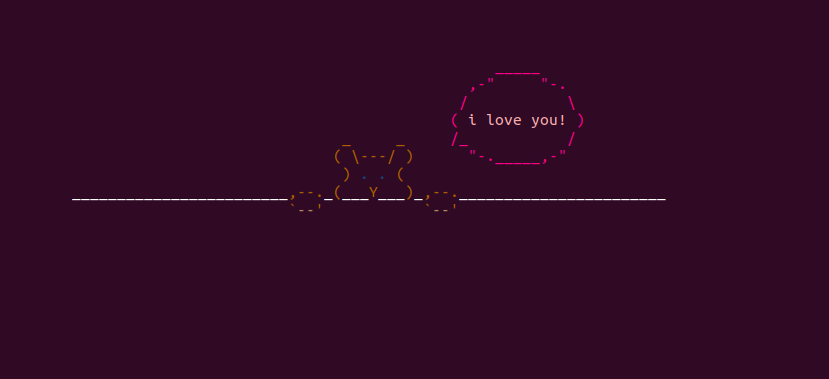

# Bear Loves You


## Build
```bash
make
```

## Run
```bash
./bear_loves_you
```

## Change program parameters
You can change the **color** of the different parts of the frames and the **time span** of the frames of different frame groups. The macros for all can be found in `bear.h`

### Color
Use the provided **ansi escape codes** or input your own!
```c
// Colors
#define BLUE                "\x1b[34m"
#define ANSI_COLOR_RESET    "\x1b[0m"
#define INTENSE_BROWN       "\033[38;5;130m"
#define LIGHT_GREEN         "\033[38;5;10m"
#define LIGHT_SKIN          "\033[38;5;223m"
#define MEDIUM_SKIN         "\033[38;5;137m"
#define DARK_SKIN           "\033[38;5;94m" 
#define LIGHT_PINK          "\033[38;5;217m" 
#define INTENSE_PINK        "\033[38;5;198m" 

// Parts' colors
#define BEAR_COLOR INTENSE_BROWN
#define BEAR_EYES_COLOR BLUE
#define BEAR_SKIN_COLOR MEDIUM_SKIN
#define TEXT_BUBBLE_COLOR INTENSE_PINK
#define TEXT_COLOR1 LIGHT_PINK
#define TEXT_COLOR2 INTENSE_PINK
```

The different parts are:
- `BEAR` the body of the bear
- `BEAR_EYES` the eyes of the bear
- `BEAR_SKIN` the skin of the bear's paws
- `TEXT_BUBBLE` the bear's text bubble
- `TEXT` the bubble's text

### Time Span
```c
#define TO_uSEC(s) s * 1000000
// Frame groups sleep time
#define BEAR_TIME 0.5
#define BUBBLE_TIME 0.03
#define TEXT_TIME 0.5
```
The macros refer to the usleep that happens after each frame print in `bear.c`.
```c
system("clear");
print_frame(i);
if(i<=5)        // Bear frame group
    usleep(TO_uSEC(BEAR_TIME));
else if(i<=13)  // Bubble frame group
    usleep(TO_uSEC(BUBBLE_TIME));
else            // Text frame group
    usleep(TO_uSEC(TEXT_TIME));
```
The three values can be changed so that the whole animation slows down or speeds up.
